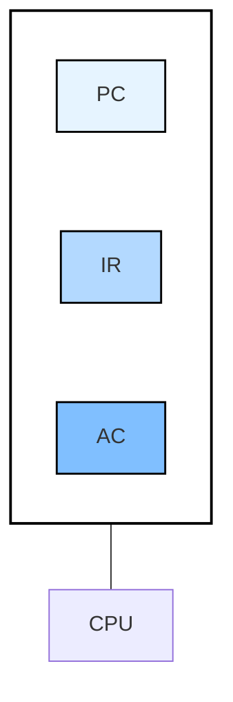

2025-03-02 20:09

Status: #adult 

Tags: [[OS]] [[main_memory]] [[university]]
___
# Máquina hipotética
![[machine.png]]
>El Address de una instrucción apunta a una dirección de memoria que contiene datos.

![[lectura-ejecucion.png]]
A la izquierda se encuentran las lecturas, a la derecha las ejecuciones.
Resolveremos el siguiente ejercicio:
![[ej_adicional.png]]
Se utiliza una representación hexadecimal tanto para las direcciones como las palabras en memoria. Es decir que el Opcode $3_{(16} = 0011_{(2}$

| Address | MP   |
| ------- | ---- |
| 400     | 3007 |
| 401     | 4880 |
| 402     | 2881 |

| Address | MP   |
| ------- | ---- |
| 880     | 0005 |
| 881     |      |
La CPU se comporta de esta manera, según cada instrucción, recordar que en el dispositivo 7, se encuentra almacenado el valor 6:

| 1era   | Lectura | Ejecución |
| ------ | ------- | --------- |
| **PC** | 400     | 401       |
| **IR** | 3007    | 3007      |
| **AC** |         | 0006      |

| 2da    | Lectura | Ejecución |
| ------ | ------- | --------- |
| **PC** | 401     | 402       |
| **IR** | 4880    | 4880      |
| **AC** | 0006    | 0001      |

| 3era   | Lectura | Ejecución |
| ------ | ------- | --------- |
| **PC** | 402     | 403       |
| **IR** | 2881    | 2881      |
| **AC** | 0001    | 0001      |
El PC queda como 403 (un índice después de la última instrucción ejecutada). La CPU conserva los valores de la última instrucción ejecutada. La memoria principal queda de la siguiente forma:

| Address | MP   |
| ------- | ---- |
| 880     | 0005 |
| 881     | 0001 |
# References
- [[Introducción a SO]]
- [[Organización del sistema de cómputo]]
- [[Operación del sistema de cómputo]]
