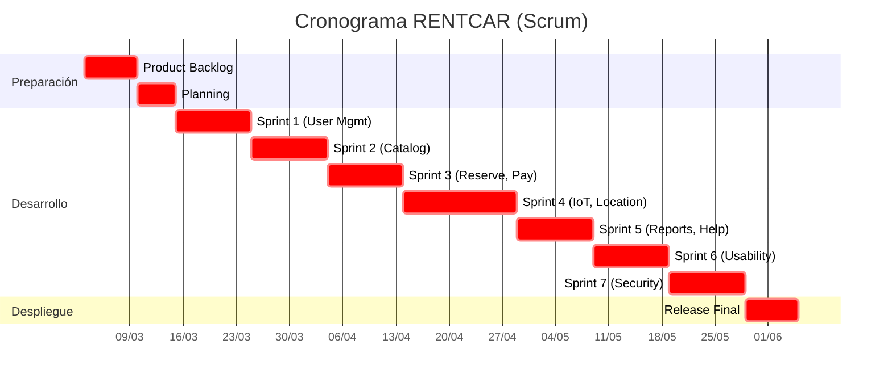

2025-02-28 17:11

Status: #adult

Tags: [[soft_design]] [[soft_arch]] [[university]]
___
# Scrum Taller 2

| **Nombre de Tarea**                                                                                                                                                                                  | **Duración** | **Comienzo** | **Fin**      | **Predecesoras** | **Recursos**                                   |
| ---------------------------------------------------------------------------------------------------------------------------------------------------------------------------------------------------- | ------------ | ------------ | ------------ | ---------------- | ---------------------------------------------- |
| **Product Backlog**: Lista de R.F (consultar, reservar, pagar, facturar, entregar autos, gestión de usuarios, reportes, integración pagos) y RNF No Funcionales (seguridad, escalabilidad, backups). | 7 días       | lun 03/03/25 | mar 11/03/25 | —                | Equipo Scrum (Daniel, Jhonayker, Camilo, Iván) |
| **Sprint Planning**: Planificación de sprints para desarrollo de módulos clave (usuarios, autos, pagos, IoT, reportes).                                                                              | 5 días       | mié 12/03/25 | mar 18/03/25 | 1                | Scrum Master (Jhonayker), PO (Daniel)          |
| **Sprint Backlog S1**: Desarrollo de módulo de gestión de usuarios (registro, membresías Gold/Silver/Estándar, CRUD).                                                                                | 10 días      | jue 20/03/25 | mié 02/04/25 | 2                | Equipo Desarrollo (Camilo, Iván)               |
| **Sprint 1**: Implementación de catálogo de autos (consultar, explorar precios, verificación licencia en línea).                                                                                     | 10 días      | jue 03/04/25 | mié 16/04/25 | 3                | Equipo Desarrollo + Frontend (Daniel)          |
| **Sprint 2**: Sistema de reservas (reservar, CRUD, cálculo de costos con descuentos por membresía).                                                                                                  | 10 días      | jue 17/04/25 | mié 30/04/25 | 4                | Equipo Desarrollo + Backend (Jhonayker)        |
| **Sprint 3**: Integración de pagos (PayPal/PayU/PSE) + facturación automática.                                                                                                                       | 10 días      | jue 01/05/25 | mié 14/05/25 | 5                | Equipo Desarrollo + DevOps (Camilo)            |
| **Sprint 4**: Módulo IoT para entrega de autos (ZipCar) + geolocalización en parqueaderos.                                                                                                           | 15 días      | jue 15/05/25 | mié 04/06/25 | 6                | Equipo IoT (Jhonayker, Iván)                   |
| **Sprint 5**: Reportes de novedades (averías, combustible, incidentes) + integración con Help Desk.                                                                                                  | 10 días      | jue 05/06/25 | mié 18/06/25 | 7                | Equipo Desarrollo + QA (Daniel)                |
| **Sprint 6**: Multilenguaje, multimoneda + estándares de usabilidad (interfaz web/móvil).                                                                                                            | 10 días      | jue 19/06/25 | mié 02/07/25 | 8                | Equipo Frontend (Camilo, Iván)                 |
| **Sprint 7**: Implementación de seguridad, escalabilidad (IaaS) y políticas de backup.                                                                                                               | 10 días      | jue 03/07/25 | mié 16/07/25 | 9                | DevOps (Jhonayker)                             |
| **Despliegue**: Release en web y app móvil + interoperabilidad con sistema financiero.                                                                                                               | 7 días       | jue 17/07/25 | mié 25/07/25 | 10               | Equipo Completo                                |

---

## Detalles Clave del Proyecto

1. **Duración de Sprints**: 10-15 días para equilibrar agilidad y complejidad (ej: IoT requiere más tiempo).
2. **Predecesoras**: Cada sprint depende del anterior para garantizar integración progresiva.
3. **Recursos**: Roles específicos asignados según expertise (Frontend, Backend, DevOps, IoT).
4. **Cobertura de Requisitos**:
   - **Funcionales**: CRUD en todas las operaciones, membresías, pagos, facturación, IoT, reportes.
   - **No Funcionales**: Seguridad, escalabilidad (IaaS), backups, usabilidad (multilenguaje/moneda).
5. **Entregables Incrementales**: Cada sprint aporta un módulo funcional probado.

---

## Línea Temporal (Diagrama de Gantt)

---

## Presupuesto del Proyecto

| **Rubro**                     | **Impacto** | **Costo Estimado (COP)**       | **Detalles**                                                                 |
|-------------------------------|-------------|--------------------------------|-----------------------------------------------------------------------------|
| **Entorno de Desarrollo**     | Medio       | $5,000,000 - $10,000,000      | Licencias de PyCharm/IntelliJ ($2-5M/año), Docker/Git (gratis o costos bajos). |
| **Entorno de Pruebas**        | Alto        | $30,000,000 - $60,000,000     | Servidores en la nube (AWS EC2), Jenkins, Selenium, Postman, automatización. |
| **Entorno de Despliegue**     | Alto        | $50,000,000 - $100,000,000    | Servidores cloud (AWS/Azure/GCP), CI/CD (pipelines), almacenamiento (S3).   |
| **Repositorio de Código**     | Bajo        | $0 - $5,000,000               | GitHub/GitLab (gratis para equipos pequeños; planes avanzados hasta $5M/año). |
| **Servicios en la Nube**      | Alto        | $40,000,000 - $80,000,000     | AWS Lambda, Firebase, API Gateway, bases de datos (DynamoDB, Firestore).    |
| **Instancias y Aprovisionamiento** | Alto   | $60,000,000 - $120,000,000    | Máquinas virtuales (EC2), servidores dedicados, balanceadores de carga.     |
| **Licencias de Software**     | Medio       | $10,000,000 - $20,000,000     | JIRA ($5-10M/año), Slack ($3-5M/año), herramientas de análisis de código.    |
| **Modelos de Entrega (Scrum)**| Bajo        | $0 - $5,000,000               | Herramientas ágiles (Trello gratis, certificaciones o capacitación).        |
| **Infraestructura de Seguridad** | Medio    | $15,000,000 - $30,000,000     | Certificados SSL ($1-3M/año), MFA, protección DDoS (Cloudflare o AWS Shield). |
| **Equipo de Trabajo (6 meses)**| -          | $180,000,000 - $300,000,000   | Salarios para 4 personas (desarrolladores, DevOps, Scrum Master, QA).       |
| **Contingencias**             | -           | $30,000,000 - $50,000,000     | Impuestos, gastos no previstos, ajustes de alcance.                         |
| **Total**                     |             | **$420,000,000 - $780,000,000**|                                                                             |

---